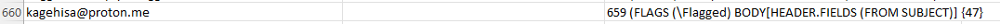
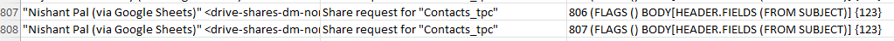

# This is nosy email cleaner perceptron.

* Create a hard-coded system
* Train a linear classifier perceptron


## INSTALLATION
```bash
git clone https://github.com/kagehisa4/nosy_email_cleaner
cd train.py
```
## Problems in the imported dataset (before preprocessing):

1. 

  - emails inside <> - extract the string
  - some subject texts UTF encoded - decode UTF into normal text.
  - flags are present as text - convert to text

2. 

  - some subjects are empty cells - delete the rows

3. 

  - duplicates are present - delete duplicates
